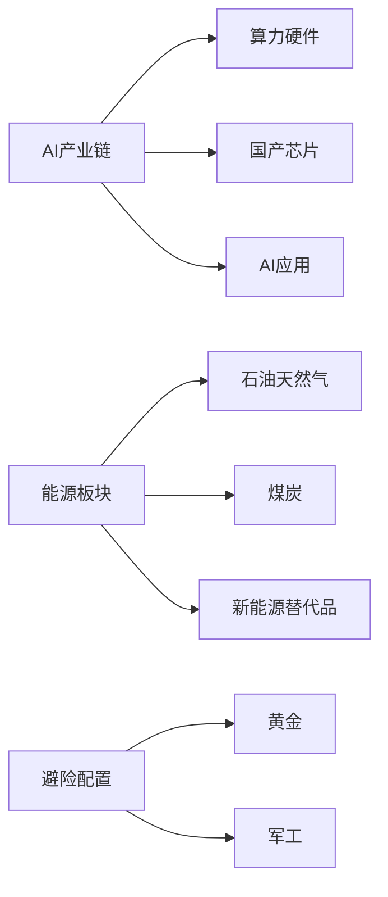

> 本周全球市场迎来重大转折：DeepSeek V4震撼发布引发AI格局重构，中国叫停Meta AI收购加速技术脱钩，霍尔木兹海峡危机推动油价突破100美元，地缘政治与科技创新双重驱动市场变革。本文深度分析最新动态并给出投资策略。

---

## 一、全球AI格局重大重构

### DeepSeek V4：中国AI技术实力的里程碑

**核心突破**
- **性能表现**：DeepSeek V4 Pro版超越所有开源模型，仅次于Gemini-Pro-3.1
- **技术亮点**：同时适配华为昇腾NPU和英伟达GPU，华为芯片参与训练
- **成本优势**：价格降至原价25%，大幅降低AI算力成本

**市场影响分析**
```
技术层面：
• 中美AI技术差距显著缩小
• 国产算力获得国际认可
• 华为昇腾芯片实现重大突破

市场层面：
• 全球AI算力成本结构重塑
• 推动AI应用普及加速
• 创造新的产业链机遇

产业链变革：
• 华为供应链受益明显
• 国产替代进程加速
• AI算力硬件迎来春天
```

### 中美科技脱钩加速：Meta收购被叫停

**事件概述**
- 中国国家发改委阻止Meta 20亿美元收购新加坡AI初创公司Manus
- 要求"撤销交易"，Manus联合创始人被限制离境
- 显示中国加强对前沿技术投资的管控

**战略意义**
- **技术自主**：确保AI技术不被外资控制
- **安全考量**：防止关键技术外流和知识产权流失
- **产业保护**：为国内AI企业发展创造空间

**市场反应**
- 国内AI龙头企业获得政策支持
- 外资在华AI投资面临更严格审查
- 技术竞争格局发生根本性变化

---

## 二、地缘政治危机与能源市场剧变

### 霍尔木兹海峡：全球能源大动脉濒临瘫痪

**危机现状**
- **谈判僵局**：美伊谈判彻底破裂，特朗普取消赴巴和谈
- **航运中断**：每日1000-1300万桶石油无法进入国际市场
- **价格冲击**：布伦特原油涨至101.71美元/桶，WTI原油96.262美元/桶

**市场影响**
```
供应缺口：全球石油供应缺口接近10亿桶
价格传导：成品油价格飙升，裂解价差创近两年新高
通胀压力：多国面临滞胀风险，欧洲央行加息预期提前
```

### 中东冲突扩大：黎以战线蔓延

**冲突升级**
- 黎巴嫩真主党袭击以色列梅卡瓦坦克并成功命中
- 回应以色列违反停火协议的行为
- 冲突有向黎以方向扩散的明显迹象

**地缘风险**
- 多线冲突风险增加，地区力量对比正在变化
- 能源安全受到进一步威胁
- 美国战略注意力分散，中国地缘政治收益增加

---

## 三、经济基本面与市场表现

### 中国经济：工业利润加速增长

**关键数据**
- 一季度工业企业利润同比增长15.5%
- 为半年以来最快增速
- 经济复苏动能持续增强

**市场表现**
- 中信证券Q1净利润102.16亿元，同比增长54.60%
- 东方财富Q1净利润37.38亿元，同比增长37.67%
- 券商板块盈利超预期，确认慢牛格局

**政策影响**
- 经济向好可能支持货币政策保持适度宽松
- A股盈利修复预期增强，价值股获得支撑
- 消费复苏相关板块受益明显

### 全球经济分化加剧

**日本经济下行**
- 2027财年经济增长预期下调至0.7%
- 通胀预期从1.9%大幅上修至2.8%
- 受高油价和能源进口成本压力影响

**通胀压力传导**
- 陶氏化学聚乙烯涨价60%
- 霍尔木兹海峡受阻推升石化成本
- 全产业链面临成本上升压力

---

## 四、投资策略分析

### 短期策略（1-2周）

**核心布局**


**具体标的**
- **AI链条**：华为供应链、AI芯片、国产算力、DeepSeek概念股
- **能源板块**：石油天然气龙头、煤炭、新能源替代技术
- **避险资产**：黄金军工，防御性配置

### 中期布局（1-3个月）

**赛道选择**
1. **AI技术革命**
   - 产业增量需求明确
   - 政策支持力度大
   - 技术突破频繁

2. **国产替代进程**
   - 自主可控需求迫切
   - 政策持续加码
   - 产业链逐步成熟

3. **能源转型受益**
   - 高油价推动替代加速
   - 碳中和目标明确
   - 技术路线逐渐清晰

### 风险管理

**主要风险点**
- **地缘风险**：中东冲突升级可能超预期
- **技术风险**：AI技术迭代速度超预期
- **政策风险**：国际科技管制加严
- **市场风险**：高通胀导致货币政策收紧

**应对策略**
- 分散配置，控制单一板块仓位
- 设置止损位，及时调整持仓结构
- 密切关注政策变化，保持灵活性

---

## 五、下周重点关注

### 重大事件
1. **美国国会"战争权力决议"投票**（4月29日）
   - 决定"史诗怒火行动"是否进入未经授权阶段
   - 可能影响军事行动升级风险
   - 油价走势关键变量

2. **重要经济数据**
   - 中国4月PMI数据
   - 美国非农就业数据
   - 欧央行利率决议

### 持续跟踪
1. **地缘政治**
   - 霍尔木兹海峡局势变化
   - 中东冲突是否进一步扩大
   - 中美关系最新进展

2. **技术突破**
   - 华为昇腾芯片产能情况
   - AI应用落地进展
   - 新技术路线发展

3. **市场动态**
   - 油价走势及对通胀影响
   - AI板块资金流向
   - 全球央行政策调整

---

## 投资结论

本周全球市场经历了深刻变革：AI技术格局重构、地缘政治危机升级、能源市场剧变。投资者需要重新评估风险收益比，在把握AI和能源两大主线的同时，做好风险对冲。

**核心观点**：
- AI产业链长期逻辑不变，短期迎来重大催化
- 地缘危机带来的能源机会值得关注，但需警惕需求萎缩风险
- 军工黄金等避险配置价值凸显，但对冲不宜过重

**操作建议**：
- 积极布局AI核心技术标的
- 适度配置能源板块受益股
- 保持足够现金应对市场波动
- 密切关注政策变化及时调整

---

*投资有风险，入市需谨慎。本文仅为市场分析，不构成具体投资建议。*